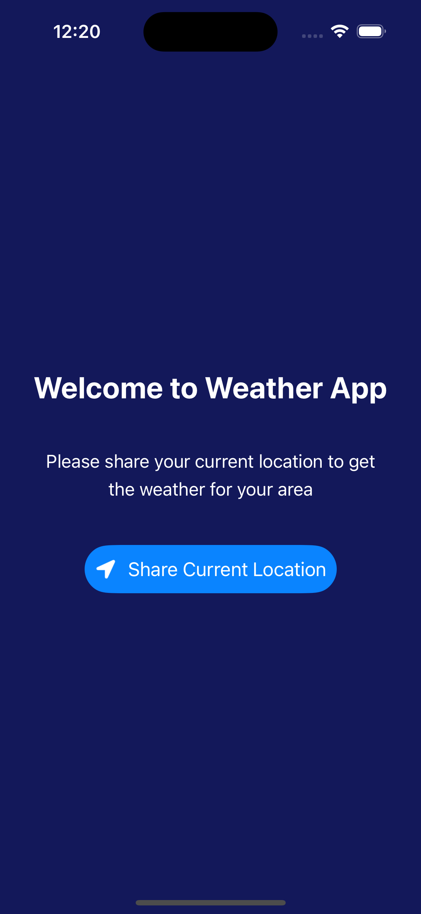
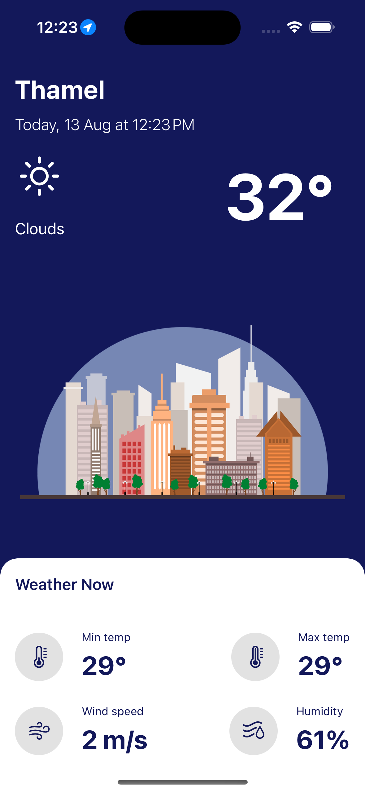

# Weather App

This is a weather app that uses the OpenWeatherMap API to get the current weather conditions and forecast for a given location.

## Steps

1. Get Current Location from Device.
2. Based on the current location, get the current weather condition for that location.
3. Display the current weather condition on the screen.

## Screenshots

### This is a simple project demonstrating how we can use location service to get the current location and display it on the screen.
